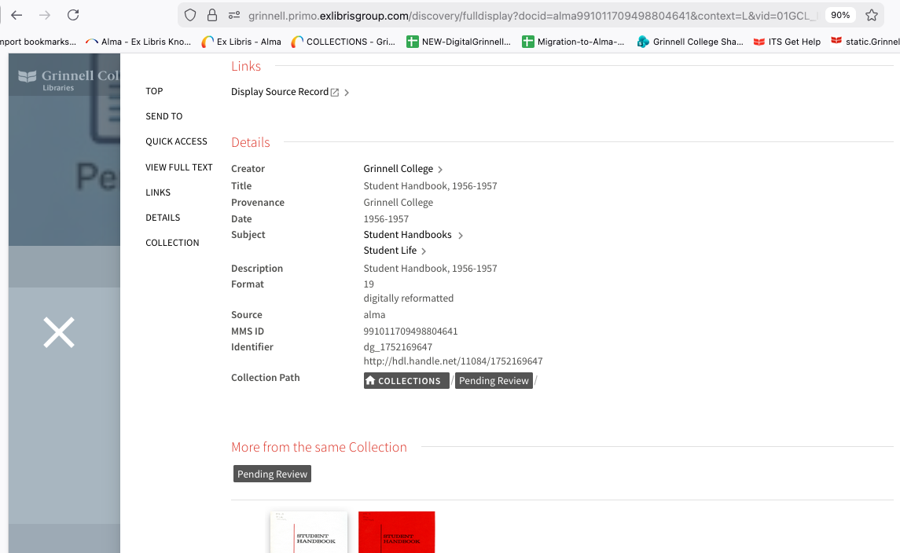

# Extent Shown as Format in Primo

This is is regard to support case `08295726 - Alma Chat - Primo display and labels` based on a response received from agent Vlad Bludyrev on 12-29-2005.  

## The Issue

This problem can perhaps best be illustrated in the attached screen capture from Primo and MMS ID `991011709498804641`.  



In the image note that `Format` with a value of `19` (the number of pages in the PDF object) represents the `dcterms:extent` field value.

```
  <dc:description xml:lang="eng">Student Handbook, 1956-1957</dc:description>
  <dcterms:extent xml:lang="eng">19</dcterms:extent>
  <dc:format xml:lang="eng">digitally reformatted</dc:format>
```

Vlad's response...

> Exlibris response: This is Vlad Buldyrev from the Primo Support Team. The label 'Format' has a code fulldisplay.format and is configurable via `Configuration` > `Discovery` > `Labels` > `Full Display Labels` mapping table.

## The Fix

### Important Discovery (January 7, 2026)

**The "Add Row" approach doesn't work for DC fields** - the display/local field management interface is only for MARC fields. DC field display labels are handled differently in Primo. See: https://knowledge.exlibrisgroup.com/Alma/Product_Documentation/010Alma_Online_Help_(English)/Metadata_Management/060Configuring_Primo_VE_Display_Configuration/030Managing_Display_and_Local_Fields

### Correct Approach for DC Fields

For Dublin Core fields, you need to work with **Primo VE normalization rules** or configure the display through **Primo Back Office** rather than creating display/local fields in Alma.

### Option 1: Modify Existing Label Mapping (Simplest)

Since `dcterms:extent` is currently displaying with the "Format" label:

1. Navigate to **Configuration** > **Discovery** > **Labels** > **Full Display Labels**

2. Find the existing code **`fulldisplay.format`**

3. **DO NOT modify this** if you need "Format" to appear for actual `dc:format` fields

4. Instead, you need to change how Primo maps the `dcterms:extent` field through an Alma normalization rule (see Option 2 below)

### Option 2: Try the Display Configuration Interface

**Discovery (January 7, 2026):** Found the actual location and format of DC normalization rules!

1. **Navigate to Display Fields**:
   - Go to **Configuration** > **Discovery** > **Display Configuration** > **Manage display and local fields**
   - You'll see a dropdown "Field to edit" with 34 fields

2. **Examine the Format field**:
   - Select "Format" from the dropdown
   - You'll see two panes: "MARC21 Normalization Rules" and "DC Normalization Rules"
   - Click the "..." menu on "DC Normalization Rules" and select "Edit"

3. **Current DC Normalization Rule for Format**:

The rule shows that `dcterms:extent` is currently mapped to display as "Format":

```
rule "prima_display format - dcterms:extent"
	when
		DCMI is "dcterms"."extent"
	then
		set TEMP"1" to DCMI."dcterms"."extent"
	    add prefix (TEMP"1","000 ")
		create operational."prima_display"."format" with TEMP"1"
end
```

This is why your `dcterms:extent` values appear with the "Format" label!

4. **The Problem**:
   - There is NO "Extent" field in the dropdown (only 34 fields exist, appears to be a limit)
   - To display `dcterms:extent` with an "Extent" label, you need a new display field
   - This requires ExLibris support assistance

### Solution: Create a Local Field for Extent

**Major Discovery (January 7, 2026):** You can create a new local field without contacting support!

**Path:** 
**Configuration** > **Discovery** > **Display Configuration** > **Manage display and local fields** > **Add field** > **Add local field**

### Step-by-Step Instructions

**Step 1: Create the Local Field Definition**

1. Navigate to **Configuration** > **Discovery** > **Display Configuration** > **Manage display and local fields**
2. Click **Add field** > **Add local field**
3. **CRITICAL:** Choose a local field between **01-50** (e.g., `local_field_50`)
   - **DO NOT use fields 51-99** - these do not support Dublin Core records
   - Local fields 01-50 have the "Use parallel Local Field from Dublin Core record" option

4. On the "Define a Local Field" screen:
   - Set **Display label** to: `Extent`
   - **Check the box**: "Use the parallel Local Field 01/50 from the Dublin Core record"
     - This checkbox is REQUIRED for DC field processing
     - It only appears for local fields 01-50
   
5. **Save** the local field definition (but we're not done yet - see steps below)

**Step 2: Create the DC Normalization Rule**

**CRITICAL:** The normalization rule must be created in the "Define a display field" section, NOT in the local field definition itself.

1. From the main "Manage display and local fields" screen
2. Click **Add field** > **Define a display field** (or use the existing entry if you already created one)
3. Set **Field to edit** to: `local_field_50` (or whichever field 01-50 you chose)
4. In the **DC Normalization Rules** section, click the **...** menu and select **Edit**
5. Add this rule:

```
rule "Primo VE - Lds50"
	when
		DCMI is "dcterms"."extent"
	then
		create operational."prima_display"."lds50" with DCMI."dcterms"."extent"
end
```

**Important notes:**
- The rule name MUST follow this exact format: `"Primo VE - LdsXX"` (system enforces this)
- Use `operational."prima_display"."ldsXX"` not `pnx."display"."ldsXX"`
- The field number (e.g., `lds50`) must match your local field number
- Adjust the number if you chose a different field (e.g., `lds01` for local_field_01)

6. **Save** the normalization rule
7. Click **Apply Rules** and wait for "Rules were applied successfully" message

**Step 3: Remove dcterms:extent from Format Field**

1. From the "Manage display and local fields" screen
2. Click **Add field** > **Define a display field**
3. Set **Field to edit** to: **Format**
4. Click the **...** menu on "DC Normalization Rules" and select **Edit**
5. Find and **DELETE** this entire rule:
   ```
   rule "prima_display format - dcterms:extent"
   	when
   		DCMI is "dcterms"."extent"
   	then
   		set TEMP"1" to DCMI."dcterms"."extent"
   	    add prefix (TEMP"1","000 ")
   		create operational."prima_display"."format" with TEMP"1"
   end
   ```
6. **Save** the changes
7. Click **Apply Rules** and wait for confirmation

**Note:** Leave the other rules in the Format field intact (for `dc:format`, `dcterms:format`, and `dcterms:medium`).

**Step 4: Add Field to Primo VE View**

**CRITICAL:** Local fields must be added to the Primo VE view configuration to display.

1. Navigate to **Configuration** > **Discovery** > **Display Configuration** > **Manage Views**
2. Select your institution's view (e.g., "01GCL_INST:GCL")
3. Click **Edit**
4. Find the **Full Display** section (or similar section controlling field display)
5. Add `local_field_50` (or your chosen field) to the list of displayed fields
6. **Save** the view configuration

**Note:** The exact path and interface for adding fields to views may vary. If you don't see a clear option to add fields, consult with colleagues who have Primo VE view configuration experience.

**Step 5: Reindex the Records**

Since display field changes are "internal" to Alma, you don't need to republish. Instead:

1. **Create a set of affected records**:
   - Create a test set with a few records containing `dcterms:extent` (or use all digital titles)
   - Navigate to **Admin** > **Manage Sets and Logical Sets**

2. **Run the "Recalculate Local Resource Types" job**:
   - Navigate to **Admin** > **Run a Job**
   - Search for: **Recalculate Local Resource Types**
   - Select your set
   - Run the job and wait for completion

**Step 6: Test the Results**

1. **Clear browser cache** or use an incognito/private window
2. **View a record in Primo** containing `dcterms:extent`:
   - Search for MMS ID `991011709498804641` (or any record with dcterms:extent)
   - You should now see:
     - **Extent**: 19 (from `dcterms:extent`)
     - **Format**: digitally reformatted (from `dc:format` - unchanged)

**Confirmed working as of January 7, 2026 using:**
- Local field: `local_field_50`
- Display label: `Extent`
- View configuration: Field added to Primo VE view
- Test record: MMS ID `991011709498804641`

### Troubleshooting

If the "Extent" label doesn't appear after following all steps:

1. **Verify local field range** - Ensure you used a field between 01-50, NOT 51-99
2. **Check the DC checkbox** - Confirm "Use the parallel Local Field 01/50 from the Dublin Core record" is checked
3. **Verify rule location** - DC normalization rule must be in "Define a display field" section, not just in local field definition
4. **Check rule syntax** - Use `operational."prima_display"."ldsXX"` not `pnx."display"."ldsXX"`
5. **Confirm "Apply Rules"** - Must click "Apply Rules" and see success message after saving normalization rules
6. **Verify view configuration** - **CRITICAL:** Local field must be added to Primo VE view to display
7. **Rerun the reindex job** - Run "Recalculate Local Resource Types" again
8. **Wait for indexing** - Can take time depending on set size
9. **Check job report** - Look for errors in completed job
10. **Clear cache** - Try incognito mode or different browser
11. **Test multiple records** - Ensure consistency across different records

### Notes on Reindexing

The "Recalculate Local Resource Types" job is the correct method to apply local field changes:

1. **Create a set** containing records with `dcterms:extent` (or use an existing set of digital titles)
2. Navigate to **Admin** > **Run a Job**
3. Search for: **Recalculate Local Resource Types**
4. Select your set
5. Run the job and wait for completion

**Important:** Changes may take time to appear in Primo depending on set size and system load. Clear browser cache or use incognito mode when testing.

### Key Insights

- **DC fields ≠ MARC fields**: Display/local field management in Alma has different requirements for DC vs MARC
- **Local fields 01-50 support DC**: Must use local fields in the 01-50 range for Dublin Core metadata processing
- **Local fields 51-99 don't support DC**: These fields cannot use the "parallel Local Field from Dublin Core record" option
- **DC normalization rules location**: Found in "Define a display field" section, not just in local field definition
- **Rule syntax matters**: Use `operational."prima_display"."ldsXX"` not `pnx."display"."ldsXX"`
- **View configuration is critical**: Local fields must be added to Primo VE view to display
- **Apply Rules is essential**: Must click "Apply Rules" after saving normalization rules for them to take effect

### Reference Links

- Managing Display and Local Fields: https://knowledge.exlibrisgroup.com/Alma/Product_Documentation/010Alma_Online_Help_(English)/Metadata_Management/060Configuring_Primo_VE_Display_Configuration/030Managing_Display_and_Local_Fields
- Dublin Core Search Indexes: https://knowledge.exlibrisgroup.com/Alma/Product_Documentation/010Alma_Online_Help_(English)/Metadata_Management/180Search_Indexes/030Dublin_Core_Search_Indexes