# Many Handles Still Not Working

A review of Alma-D objects conducted this summer shows that between 20% to 30% or our object handles DO NOT RESOLVE.  I've done quite a bit of investigation and I can find nothing to explain why some objects have valid handles while others do not.  It's was suggested in Case 07949018 that the proper sequence of operations to make handle assignments work is...

```
For already existing handles that should be redirected to Primo, it is necessary to
1. Create a set with these records
2. Run the Handle Migration job, using the control number sequence with the prefix used in the existing handles. Even if the records already have handles, this job is needed, as it copies the existing handles from the metadata to the handle identifier in the background.
3. Run the Persistent Handle Identifiers for Digital Resource integration profile on the set, selecting 'Create and Update' as action, and 'Do not add metadata' for the DC METADATA.
```

I've tried this a few times with NO success, except that the jobs I run always tend to report "SUCCESS!"  

## One More Try

I've identified three objects with the following identifiers, handles and status:   

| ID | MMS_ID | Handle | Handle Status |
|---|---|---|---|
| grinnell:88 | 991011589491704641 | http://hdl.handle.net/11084/88 | Works! |
| grinnell:99 | 991011507293904641 | http://hdl.handle.net/11084/99 | Fails |
| grinnell:32100 | 991011507142104641 | http://hdl.handle.net/11084/32100 | Fails |

I have poured over the data for these three objects trying to determine why the handle of one resolves, while the other two do not.   Initially all three objects had very similar metadata.  I have since edited the record for `grinnell:32100` to systematically remove or "correct" metadata that I thought might be causing my inability to assign a handle, but those changes appear to have made no difference.  

It should also be noted that objects `grinnell:88` and `grinnell:99` are VERY SIMILAR in structure, metadata, and digital content.  Both are from the same collection, and I believe they were migrated and then assigned handles as part of the same jobs.  

## Broken Objects In a Set

The two "broken" objects are now part of an itemized set named "Collembola Handle test", set ID `7593466560004641`.  I'm using this itemized set to try and assign handles using the suggested process that is documented above.  The creation of this set should satisfy Step 1 in that process.  

## Step 2 - Running the Handle Migration Job

I've tried to document this portion of the process in screen capture images.  

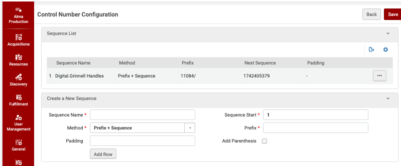

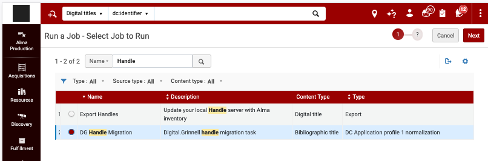

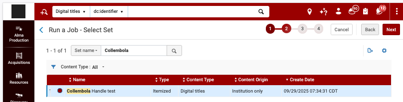

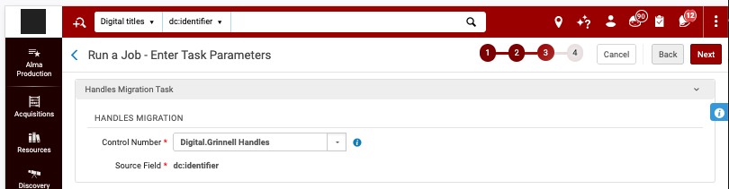


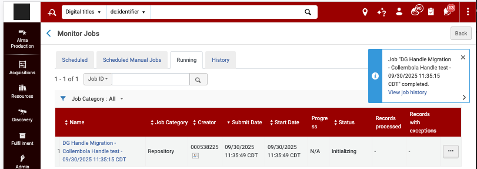

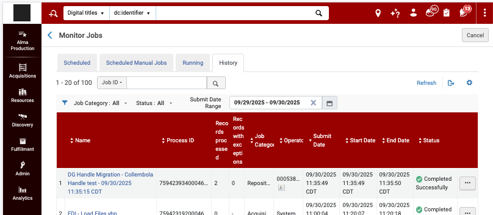

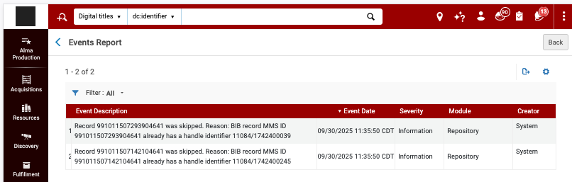

In the above image note that the system reports both objects were "skipped" because they already have existing handles, but per the report, **THEY ARE NOT THE HANDLES WE SPECIFIED**.  It appears that these two objects were assigned handles based on the Control Numbering that Alma provides for `new` objects, **NOT OUR NUMBERING scheme**!  

Based on the error messages, if I try opening http://hdl.handle.net/11084/1742400039 it does indeed resolve to object `grinnell:99`.  Likewise, http://hdl.handle.net/11084/1742400245 does indeed resolve to `grinnell:32100`.  

In Case 07949018 I was told that...

```
The message '.. already has a handle identifier ...' in the job events for the Handle Migration job can be ignored. It will always display this message for the migration of handles.
```

| It appears to me that THIS is a key symptom of our problem, if not the cause.  **How do we override those errant handles to use the meaningful handles that we assigned years ago?????**  And how/why did they get assigned to some objects, but not others, in the first place?

## Step 3 - Running the Persistent Handle Identifiers Job

I'm certain this will NOT work since I've done this many times before, but here goes...  

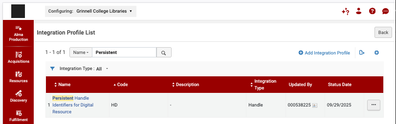

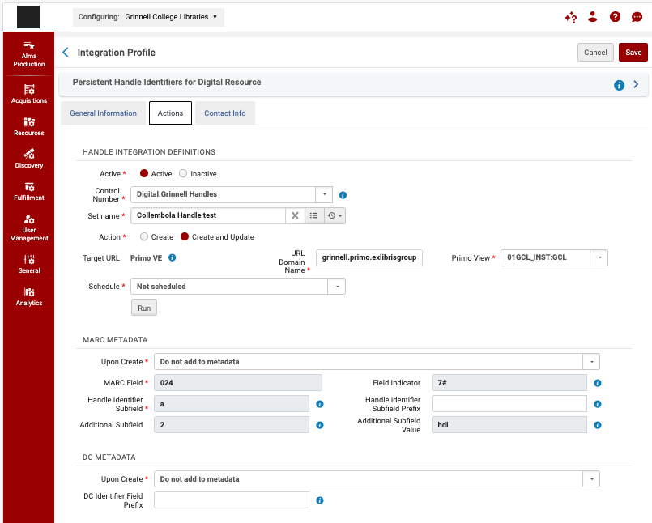

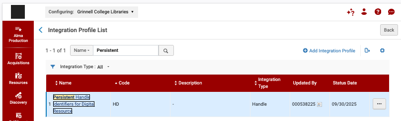

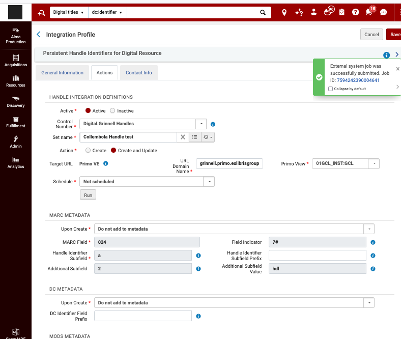

## Expected Results

IF the process worked as intended, the results would be two working handles:  

- http://hdl.handle.net/11084/99, and 
- http://hdl.handle.net/11084/32100 

Shortly after this workflow was completed I found that these handles **STILL DO NOT RESOLVE**.  This is probably because they aleady have handles that were errantly assigned to them by Alma's process that provides only sequential numeric handles, which is absolutely NOT what we need in this instance.  


