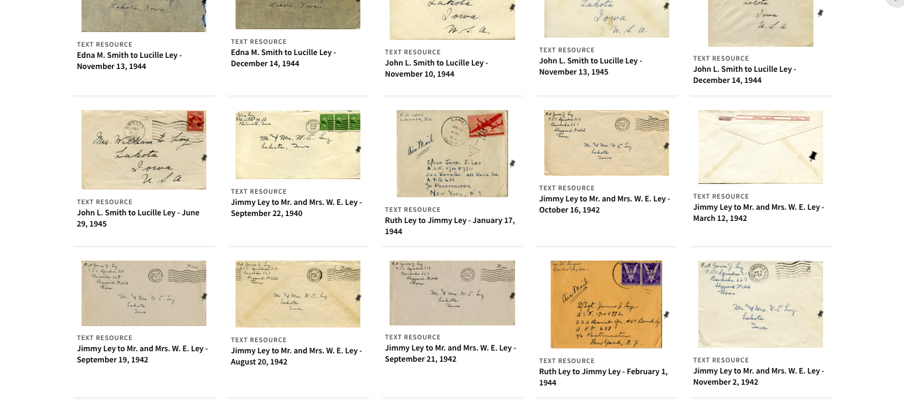
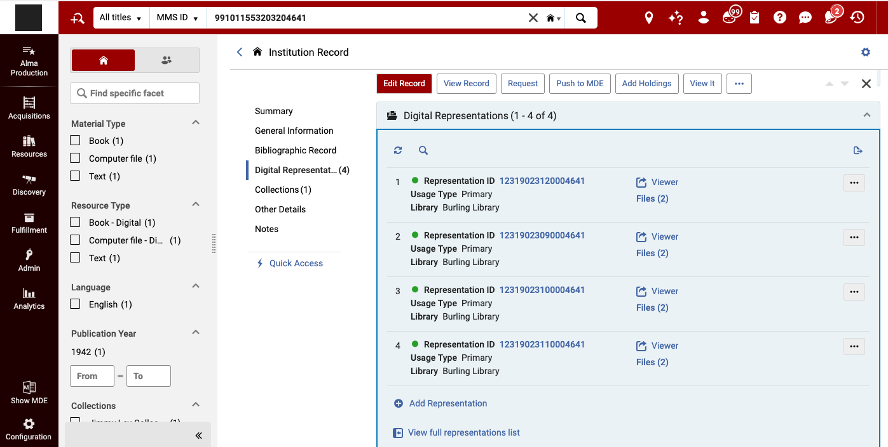
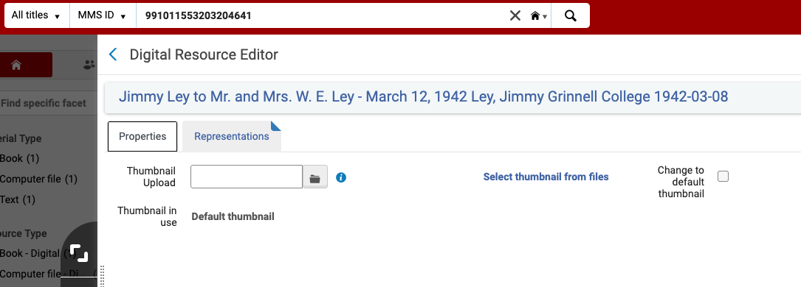
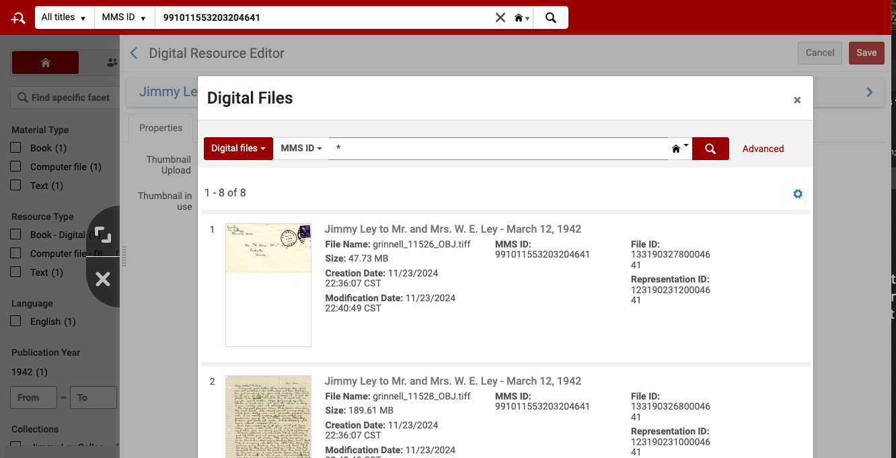
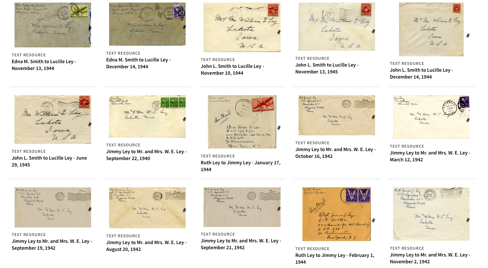

# New Thumbnail Handling - January 2025

## Summary

The Ex Libris developers provided a way to update the thumbnail for digital titles in Alma:

1. Go to **"View full representation list"** from the **"Digital Representation"** section in the repository search.
2. Go to the **"Properties"** tab
3. Upload a thumbnail or press on **"Select thumbnails from files"** and select the thumbnail you want.

## Screenshots

The following example was used to make changes to `MMS ID 991011553203204641`, a letter titled: `Jimmy Ley to Mr. and Mrs. W. E. Ley - March 12, 1942` 

### A portion of the Jimmy Ley collection in Primo before changes. The image is in the middle row, right side.

### Showing the title's digital files in Alma.

### After clicking "View full representation list".

### After choosing "Properties" tab and "Select thumbnail from files".

### The portion of the Jimmy Ley collection in Primo after saving changes to the record.

